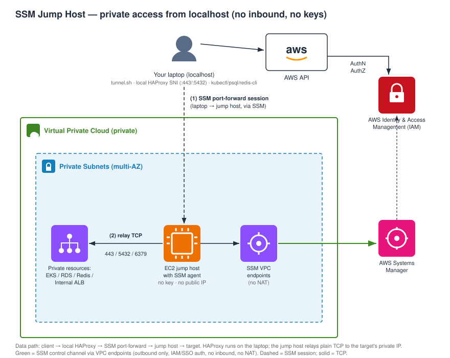

# terraform-aws-bastion

Reach **private** cloud resources (EKS API server, internal ALBs, Aurora,
RDS Proxy, ElastiCache) from your laptop **without exposing anything to the
internet**.

The bastion is a small EC2 instance in private subnets with:

- **No SSH key**
- **No public IP**
- **No inbound security group rules**

Access is exclusively through **AWS Systems Manager Session Manager**,
authenticated by your own IAM or SSO identity. A companion client script opens
SSM **port forwarding** tunnels and routes them through a local **HAProxy** so
the real hostnames resolve to `localhost`, which means TLS and certificate
validation keep working end to end. `kubectl`, `psql`, and `redis-cli` all
behave normally.



## Composition

Every AWS resource is created through a published CloudDrove module, with one
documented exception.

| Concern | Module | Version |
|---|---|---|
| Naming and tagging | `clouddrove/labels/aws` | 1.3.1 |
| Instance role | `clouddrove/iam-role/aws` | 1.4.0 |
| Bastion security group, zero ingress | `clouddrove/security-group/aws` | 2.0.3 |
| Per target ingress rules | `clouddrove/security-group/aws` | 2.0.3 |
| Launch template and Auto Scaling Group | `clouddrove/ec2-autoscaling/aws` | 1.3.4 |
| Connection audit rule | `clouddrove/cloudwatch-event-rule/aws` | 1.0.2 |
| Dashboard | `clouddrove/cloudwatch-dashboard/aws` | 1.0.1 |

The exception is session logging, which declares four `aws_*` resources
directly: two log groups, a log group resource policy, and the SSM session
document. No CloudDrove module covers any of those.
[docs/composition-tradeoffs.md](docs/composition-tradeoffs.md) records why.

## Prerequisite: enable IMDSv2 at the account level

`clouddrove/ec2-autoscaling` 1.3.4 has no `metadata_options` input, so IMDSv2
cannot be required from this module. Set it as an account and region default
instead, which is stronger because it also covers instances launched outside
this module.

```bash
aws ec2 modify-instance-metadata-defaults \
  --http-tokens required \
  --http-put-response-hop-limit 1 \
  --region eu-west-1
```

Run once per account and region. See
[docs/composition-tradeoffs.md](docs/composition-tradeoffs.md) for this and two
other properties the composition cannot express, each with a workaround.

## Usage

### Existing VPC

The VPC must already reach Systems Manager, either through the `ssm`,
`ssmmessages`, and `ec2messages` interface endpoints or through NAT. Without one
of those the SSM agent cannot register and the bastion stays invisible to
Session Manager.

```hcl
module "bastion" {
  # This repository is private and is not published to the Terraform Registry,
  # so `source = "clouddrove/bastion/aws"` does not resolve. Pin a commit.
  source = "git::https://github.com/clouddrove/terraform-aws-bastion.git?ref=969b02e"

  name        = "myproject"
  environment = "dev"

  vpc_id     = "vpc-0abc"
  vpc_cidr   = "10.60.0.0/16"
  subnet_ids = ["subnet-0a", "subnet-0b"]
}
```

There are no tags yet, so `ref` takes a commit SHA. Find the current one with:

```bash
git ls-remote https://github.com/clouddrove/terraform-aws-bastion.git master
```

Do not use `ref=master`. Terraform caches modules in `.terraform/modules`, so a
moving ref means two runs of the same configuration can build different
infrastructure with no diff to explain it.

### Giving CI access to a private module

`terraform init` clones this repository over the network, so any runner needs
credentials. Without them it fails with `Repository not found`, which is a
permissions error rather than a missing repository.

**GitHub Actions**, using a token with read access to this repository:

```yaml
- name: Allow Terraform to clone private modules
  run: |
    git config --global url."https://oauth2:${{ secrets.MODULE_READ_TOKEN }}@github.com".insteadOf "https://github.com"
- run: terraform init
```

The default `GITHUB_TOKEN` is scoped to the calling repository alone and cannot
read this one. Use a fine-grained PAT, a GitHub App installation token, or make
the runner a member of a team with read access.

**Deploy key**, for CI outside GitHub Actions. Add the public half to this
repository's deploy keys, then switch the source to SSH:

```hcl
source = "git::ssh://git@github.com/clouddrove/terraform-aws-bastion.git?ref=969b02e"
```

Watch for a global `insteadOf` rule rewriting HTTPS to SSH or the reverse. It
applies to Terraform's clones too, and silently overrides whichever protocol
the source specifies.

### Greenfield

[`examples/complete`](examples/complete) builds the VPC, private subnets, and
SSM interface endpoints from `clouddrove/vpc/aws` and `clouddrove/subnet/aws`,
then the bastion on top. No NAT gateway and no public subnets.

```bash
cd examples/complete
terraform init
terraform apply -var region=eu-west-1 -var name=myproject -var environment=dev
```

### Letting the bastion reach your resources

The bastion security group allows egress to the whole VPC CIDR, but each target
must also allow **inbound** from the bastion security group. List the target
security groups and ports and this module attaches the rules for you, without
editing the targets' own modules.

```hcl
target_ingress_rules = [
  { security_group_id = "sg-0eks",    port = 443,  description = "EKS API from bastion" },
  { security_group_id = "sg-0aurora", port = 5432, description = "Aurora from bastion" },
  { security_group_id = "sg-0redis",  port = 6379, description = "Redis from bastion" },
]
```

Leave it empty for a greenfield deploy and fill it in once the targets exist.

> **EKS `kubectl` access is separate.** Your own IAM or SSO principal also needs
> an EKS access entry on the cluster. That is a property of your identity, not
> of the bastion.

## Client: opening the tunnels

The [`client/`](client) directory holds the piece with no equivalent on the
registry: SSM port forwarding plus a local HAProxy SNI router, so private
endpoints answer on their real hostnames with TLS intact.

**Requirements** (macOS shown, `sudo` needed because HAProxy binds 443 and 5432
and the script edits `/etc/hosts`):

| Tool | Install |
|---|---|
| AWS CLI v2 | `brew install awscli` |
| Session Manager plugin | `brew install --cask session-manager-plugin` |
| `jq` | `brew install jq` |
| `haproxy` | `brew install haproxy` |

**Configure and run:**

```bash
cd client
./bootstrap.sh            # writes AWS SSO profiles into ~/.aws/config
./bootstrap.sh --dry-run  # preview without writing

aws sso login --sso-session <your-sso-session>

./tunnel.sh --env dev
```

Point `client/tunnel.json` at the bastion this module created:

```bash
terraform output tunnel_config
```

Leave `tunnel.sh` running. Ctrl+C tears down every tunnel and kills HAProxy.

**Connect:**

```bash
kubectl --kubeconfig ~/.kube/config-tunnel --context dev get nodes
psql "host=<real-aurora-endpoint> port=5432 sslmode=require dbname=app user=app_user"
redis-cli -h localhost -p 18004 --tls
```

## Availability

`desired_capacity` defaults to 1. Raising it does **not** keep an in flight
tunnel alive: SSM sessions bind to an instance ID and cannot fail over. What a
second instance buys is time to reconnect, immediate rather than waiting out an
Auto Scaling Group replacement of roughly three minutes.

## Session logging and audit

CloudTrail is the audit source, not Session Manager transcript logging.
Transcripts capture terminal output, and port forwarding sessions have no
terminal. CloudTrail `StartSession` events carry the caller identity, the target
instance, the document name, and the port forwarding parameters, which is who
connected, when, and to which private host and port.

The module turns that into two log groups, both at `log_retention_days` (7 by
default), and one dashboard.

| Log group | Holds | Created when |
|---|---|---|
| `/aws/bastion/<name>/connections` | One flat record per `StartSession`, `ResumeSession`, and `TerminateSession`: principal, source IP, target instance, tunnelled host and port, session ID | `logging_enabled` (default true) |
| `/aws/ssm/session/<name>` | Full terminal transcripts of interactive shells | `session_preferences_managed` (default false) |

The connection audit covers every session type, including the port forwards
`client/tunnel.sh` opens. Transcript logging covers interactive shells only.

### Prerequisite: a CloudTrail trail in the region

Session Manager publishes no native EventBridge event, so the audit rule matches
CloudTrail-sourced API calls, and those reach EventBridge only while a trail is
logging management events. Without a trail the log group stays empty and the
dashboard shows nothing.

```bash
aws cloudtrail describe-trails --query 'trailList[].{Name:Name,Multi:IsMultiRegionTrail}' --output table
```

Most accounts already have an organization trail. The module does not create
one, because a trail is account level state that outlives any single bastion.

### Turning on shell transcripts

`session_preferences_managed = true` creates `SSM-SessionManagerRunShell`. That
document is an **account and region singleton**: it governs shell logging for
every SSM session in the region, not only this bastion's, and two deployments in
one account collide on it. Leave it false in shared accounts.

If the document already exists, import it first or the apply fails:

```bash
terraform import 'module.bastion.aws_ssm_document.session_preferences[0]' SSM-SessionManagerRunShell
```

Running with `create_iam_role = false` means the module cannot grant the
instance the CloudWatch Logs writes transcripts need, since it does not own the
role. Attach `terraform output -raw session_log_policy_json` to your role
yourself.

### Dashboard

`terraform output -raw dashboard_url` opens it. Seven widgets: recent sessions,
sessions per principal, event counts, instances in service, CPU, network, and
shell transcripts. Log widgets follow the dashboard time picker, which defaults
to the last 7 days.

Session duration is not a widget, because it needs start and end paired by
session ID. Run this in Logs Insights against the audit group instead:

```
fields @timestamp, event, principal, coalesce(sessionId, endedSession) as sid, targetHost, targetPort
| stats earliest(principal) as who,
        earliest(targetHost) as host,
        earliest(targetPort) as port,
        min(@timestamp) as started,
        max(@timestamp) as ended,
        (max(@timestamp) - min(@timestamp)) / 1000 as duration_seconds
  by sid
| sort started desc
```

A row with `duration_seconds` near zero is a session still open, or one whose
`TerminateSession` fell outside the query window.

### Scope of the audit rule

Session targets are instance IDs the Auto Scaling group assigns at launch, so
they cannot be matched in a static EventBridge pattern. The rule therefore
records SSM sessions to **every instance in the region**, not only this
bastion's. That is a wider net rather than a narrower one; the `instance` field
identifies which host each session went to.

## Cost

- One `t4g.micro` runs roughly 3 to 5 USD per month on demand. Setting
  `schedule_enabled = true` stops it outside working hours and roughly halves
  that.
- Interface VPC endpoints cost roughly 7 USD per month each per AZ, three of
  them. Still cheaper and more private than a NAT gateway, which is why
  `examples/complete` uses endpoints.
- Session logging is close to free. Connection records are a few hundred bytes
  each and a busy team produces a few thousand a month, well under 1 USD of
  ingestion at 7 day retention. Shell transcripts scale with terminal output, so
  budget more if `session_preferences_managed` is on and sessions are chatty.
  The dashboard is free: an account gets 3 at no charge, then 3 USD each.

## Security notes

- The instance role carries `AmazonSSMManagedInstanceCore` plus, when
  `logging_enabled` is true, an inline policy allowing CloudWatch Logs writes
  under `/aws/ssm/session/`. That managed policy grants no `logs:PutLogEvents`,
  so shell transcripts do not stream without it. Add anything further through
  `extra_iam_policy_arns` only with a concrete reason.
- Restrict who may connect with IAM: scope `ssm:StartSession` on the
  `AWS-StartPortForwardingSessionToRemoteHost` document to the intended roles.
- There are no long lived keys on the host to rotate.

## Troubleshooting

| Symptom | Cause and fix |
|---|---|
| `bastion '...' not found; skipping env` | Instance not running, wrong region or profile, or the Name tag does not match. Compare `terraform output name` with `client/tunnel.json`. |
| `[FATAL] AWS credentials check failed` | Run `aws sso login --sso-session <name>`, or re-run `./bootstrap.sh`. |
| SSM session opens then dies immediately | The bastion cannot reach SSM: missing VPC endpoints and no NAT. |
| `psql` or `kubectl` connects but hangs | The target security group does not allow inbound from the bastion. Add it to `target_ingress_rules`. |
| Stale tunnels after laptop sleep | `pkill -f session-manager-plugin; pkill -f 'haproxy -f'`, then re-run `tunnel.sh`. |
| HAProxy will not bind 443 | Something else owns the port. `sudo lsof -i :443`. |

<!-- BEGIN_TF_DOCS -->
<!-- END_TF_DOCS -->

## License

See [LICENSE](LICENSE).
